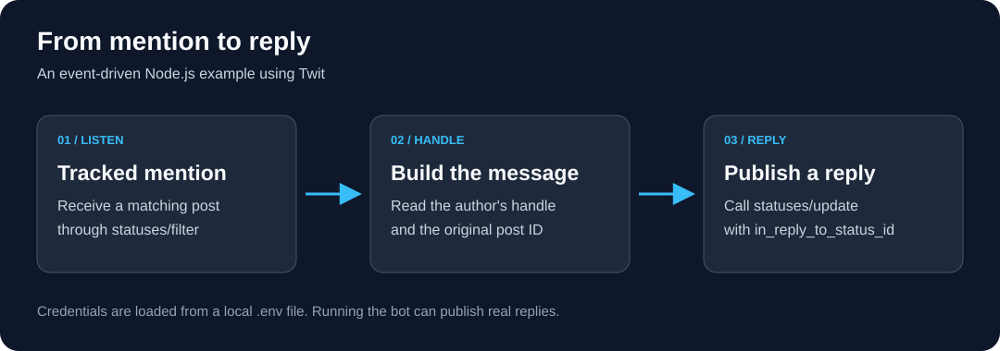

# Twitter Mention Reply Bot

A small **Node.js bot that listens for a tracked Twitter mention and posts a reply** using `twit`. It demonstrates environment-based authentication, a filtered event stream, and publishing a response linked to the original post.

This is a historical learning project, built with `twit` 2.x. Access to the endpoints used by the code must be checked against your developer account before running it; live API compatibility has not been verified.

## How it works



The diagram is stored in this repository and describes the code's behavior. It replaces the unavailable externally hosted screenshot.

1. `dotenv` loads credentials from your local `.env` file.
2. `T.stream('statuses/filter', { track: '@BOT_Eladio' })` subscribes to the configured mention.
3. The event handler reads the author's screen name and the original post ID.
4. `T.post('statuses/update', ...)` publishes a reply with `in_reply_to_status_id` set to that ID.

The current reply text is:

```text
Thank you very much for your welcome @<author>
```

This is a reply workflow, not a retweet operation.

## Requirements

- Node.js and npm. The repository does not pin a supported Node.js version.
- A developer account and credentials with access to both the streaming and publishing endpoints used in `index.js`.
- A test account whose activity you are authorized to automate.

## Setup

```sh
git clone https://github.com/EladioRocha/twitter-bot.git
cd twitter-bot
npm ci
```

Copy [.env.example](.env.example) to `.env` and fill in your own credentials. The `.env` file is ignored by Git.

| Variable | Twit configuration field |
| --- | --- |
| `API_KEY` | `consumer_key` |
| `API_KEY_SECRET` | `consumer_secret` |
| `ACCESS_TOKEN` | `access_token` |
| `ACCESS_TOKEN_SECRET` | `access_token_secret` |

Before starting, replace the tracked `@BOT_Eladio` mention in [index.js](index.js) with the account or term you intend to monitor. Edit the reply template in `tweetEvent()` if needed.

## Run

```sh
npm start
```

This runs `node index.js` and connects to the API. Matching events trigger real replies; it is not a preview or dry-run mode. Stop the process with `Ctrl+C`.

## Project structure

| Path | Purpose |
| --- | --- |
| [index.js](index.js) | Credentials, filtered stream, event handler, and reply publishing. |
| [.env.example](.env.example) | Credential variable names with empty values. |
| [package.json](package.json) | Dependencies and npm commands. |
| [docs/images/mention-reply-flow.svg](docs/images/mention-reply-flow.svg) | Repository-hosted workflow diagram. |

## Troubleshooting and limitations

- **Authentication or permission errors:** check all four credentials and whether your account supports the endpoints the code calls.
- **No events:** check the tracked term and streaming access.
- **Publishing errors:** the callback logs the error and throws it, terminating the process.
- **Repeated events:** the example does not implement deduplication, self-reply filtering, rate-limit handling, or automatic reconnection logic of its own.

The repository's `npm test` command is a placeholder that exits with an error. For a syntax check without connecting to the API, run:

```sh
node --check index.js
```

The documentation, local image, and JavaScript syntax were checked during this update. No live account was connected and no posts were published during validation.
